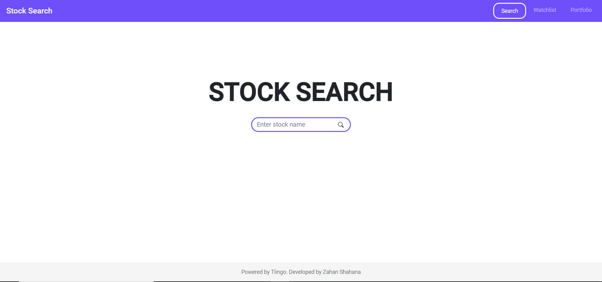
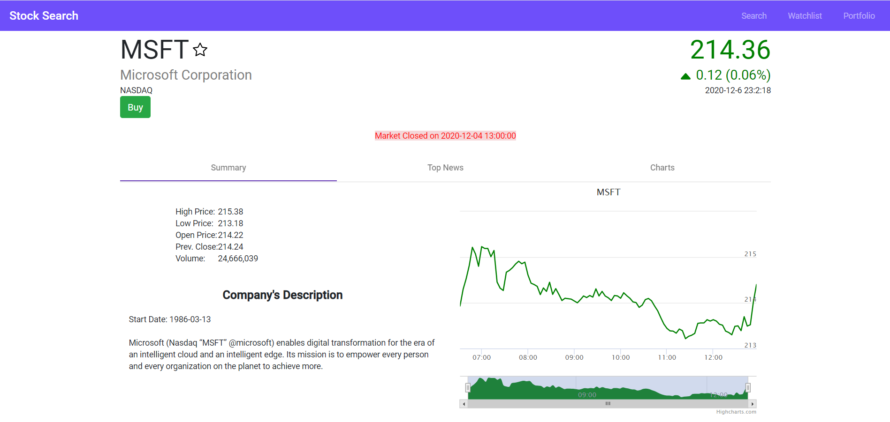
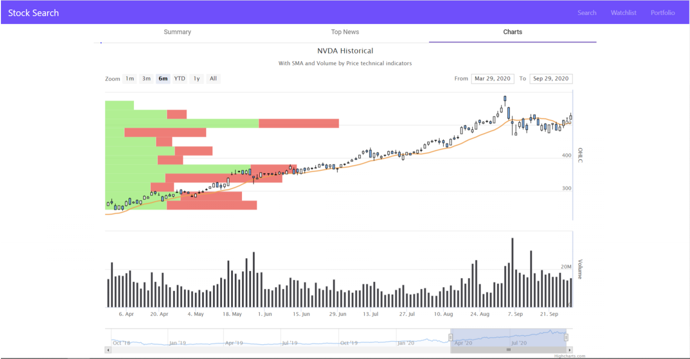
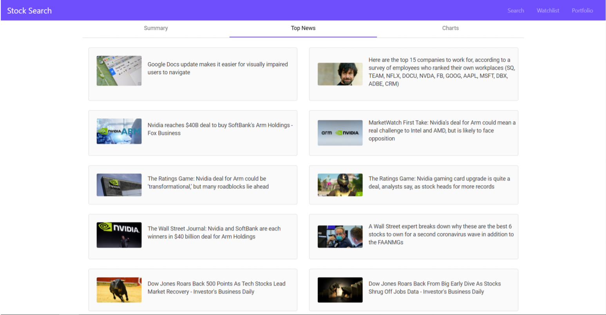
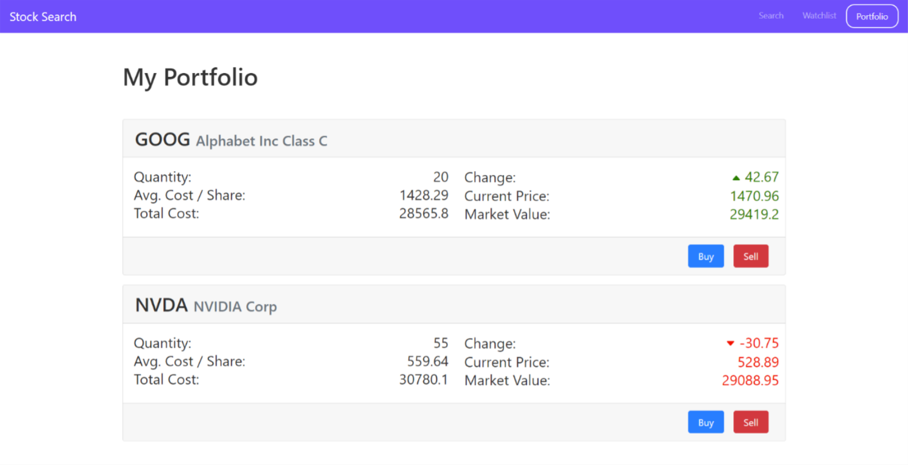

# StockSearch

A fully responsive Web App with Node.js RESTful API architecture that allows users to view any company's stock prices along with related news and real-time charts of various prices and meta-data from the Tiingo API. 
Also, there are numerous features like autocomplete, auto-refreshing live data, adding favorite stocks to a watchlist, buy and sell stocks, and sharing news articles on social media.

Chekout the website on http://www.stocksearch.pw/

## Snapshots

## Build

Run `ng build` to build the project. The build artifacts will be stored in the `dist/` directory. Use the `--prod` flag for a production build.

## Running unit tests

Run `ng test` to execute the unit tests via [Karma](https://karma-runner.github.io).
